[TOC]

## 📋 Project Metadata


| Property         | Value                     |
|------------------|---------------------------|
| **Name**         | Ansible Setup Workstation |
| **Version**      | 2.0.0                     |
| **Author**       | Ansible Team              |
| **Last Updated** | 2024                      |
| **License**      | MIT                       |
| **Language**     | Ansible, YAML             |


> **IMPORTANT** This project requires Ansible 2.9 or newer.

## 🚀 Introduction

This repository contains a complete set of Ansible roles and playbooks designed for the provisioning, hardening, and maintenance of Linux workstations. It provides an automated solution to standardise development, production, and lab environments.

## 📦 System Roles

### Category: Security & Hardening

| Role                 | Description                                    | Dependencies     | Related Files                |
|----------------------|------------------------------------------------|------------------|------------------------------|
| `hardening_debian`   | Basic security configuration for Debian/Ubuntu | `sshd`, `sudo`   | `/roles/hardening_debian/`   |
| `rkhunter`           | Rootkit Hunter – malware & rootkit detection   | `apt`, `bash`    | `/roles/rkhunter/`           |
| `tripwire`           | Integrity‑based intrusion detection            | `openssl`        | `/roles/tripwire/`           |
| `sshd`               | Secure SSH configuration                       | `openssh-server` | `/roles/sshd/`               |
| `sudo`               | Sudo configuration & access control            | `sudo`           | `/roles/sudo/`               |
| `auditd`             | System event auditing                          | `auditd`         | `/roles/auditd/`             |
| `fail2ban`           | DDoS & brute‑force protection                  | `python`         | `/roles/fail2ban/`           |
| `grub_audit_backlog` | GRUB protection with audit backlog             | `grub-pc`        | `/roles/grub_audit_backlog/` |

> **NOTE** Security roles must run before configuration roles.

### Category: System Configuration

| Role                            | Description                      | Dependencies         | Related Files                           |
|---------------------------------|----------------------------------|----------------------|-----------------------------------------|
| `configure-timezone`            | Time‑zone configuration          | `tzdata`             | `/roles/configure-timezone/`            |
| `configure_login_defs`          | login_defs configuration         | `logindefs`          | `/roles/configure_login_defs/`          |
| `configure_local_login_banner`  | Local login banner               | `banner`             | `/roles/configure_local_login_banner/`  |
| `remove_unused_accounts_groups` | Cleanup orphan accounts & groups | `passwd`, `groupadd` | `/roles/remove_unused_accounts_groups/` |

### Category: Package Management & Updates

| Role                                  | Description                   | Dependencies          | Related Files                                 |
|---------------------------------------|-------------------------------|-----------------------|-----------------------------------------------|
| `update_upgrade`                      | System update                 | `apt`, `aptitude`     | `/roles/update_upgrade/`                      |
| `unattended_upgrades`                 | Automatic unattended upgrades | `unattended-upgrades` | `/roles/unattended_upgrades/`                 |
| `remove_bloatware_packages`           | Remove unnecessary packages   | `apt`, `dpkg`         | `/roles/remove_bloatware_packages/`           |
| `suggested_software_packages`         | Suggested software packages   | `apt`                 | `/roles/suggested_software_packages/`         |
| `suggested_software_packages_desktop` | Suggested desktop packages    | `apt`, `gnome`        | `/roles/suggested_software_packages_desktop/` |

### Category: Monitoring & Logging

| Role              | Description                                        | Dependencies     | Related Files             |
|-------------------|----------------------------------------------------|------------------|---------------------------|
| `sysstat`         | System resource monitoring                         | `sysstat`        | `/roles/sysstat/`         |
| `file_permission` | File permission configuration                      | `chmod`, `chown` | `/roles/file_permission/` |
| `auditd`          | System event auditing (duplicate for completeness) | `auditd`         | `/roles/auditd/`          |

### Category: Desktop & Workspace

| Role                                  | Description                | Dependencies    | Related Files                                 |
|---------------------------------------|----------------------------|-----------------|-----------------------------------------------|
| `gnome`                               | GNOME configuration        | `gnome`, `gdm3` | `/roles/gnome/`                               |
| `suggested_software_packages_desktop` | Suggested desktop packages | `apt`, `gnome`  | `/roles/suggested_software_packages_desktop/` |

### Category: Miscellaneous

| Role        | Description                              | Dependencies    | Related Files       |
|-------------|------------------------------------------|-----------------|---------------------|
| `otpclient` | OTP client for two‑factor authentication | `libsecret-1-0` | `/roles/otpclient/` |
| `aide`      | Integrity‑based intrusion detection      | `aide`          | `/roles/aide/`      |

## ▶️ Automation Playbooks

| Playbook                             | Purpose                         | Roles Used                              | Estimated Duration  |
|--------------------------------------|---------------------------------|-----------------------------------------|---------------------|
| `setup_workstation.yaml`             | Full workstation bootstrap      | All roles                               | 15–30 min           |
| `update_upgrade.yaml`                | System and package updates      | `update_upgrade`, `unattended_upgrades` | 5–10 min            |
| `remove_bloatware_packages.yaml`     | Remove unnecessary packages     | `remove_bloatware_packages`             | 2–5 min             |
| `remove_unused_accounts_groups.yaml` | Remove orphan accounts & groups | `remove_unused_accounts_groups`         | 1–2 min             |
| `shutdown.yaml`                      | Graceful system shutdown        | N/A                                     | 1–2 min             |

## 🔧 How to Use

### Full Bootstrap Execution

```bash
# Provision the entire workstation
ansible-playbook -i inventory/your_inventory playbooks/setup_workstation.yaml

# Verbose output
ansible-playbook -v -i inventory/your_inventory playbooks/setup_workstation.yaml

# Check mode
ansible-playbook -C -i inventory/your_inventory playbooks/setup_workstation.yaml
```

### Execute Individual Roles

```bash
# Update system
ansible-playbook -i inventory/your_inventory playbooks/update_upgrade.yaml

# Remove unnecessary packages
ansible-playbook -i inventory/your_inventory playbooks/remove_bloatware_packages.yaml

# Remove orphan accounts and groups
ansible-playbook -i inventory/your_inventory playbooks/remove_unused_accounts_groups.yaml
```

### Example Inventory

```yaml
# inventory/production.yml
all:
  hosts:
    workstation1.example.com:
      ansible_user: root
      ansible_become: true
    workstation2.example.com:
      ansible_user: ansible
      ansible_become: true
```

## 🏗️ System Architecture



```mermaid
graph TD
    A[Main Playbook] --> B[Security Roles]
    A --> C[Configuration Roles]
    A --> D[Package & Update Roles]
    A --> E[Monitoring Roles]
    A --> F[Desktop Roles]
    
    B --> B1[hardening_debian]
    B --> B2[rkhunter]
    B --> B3[tripwire]
    B --> B4[sshd]
    B --> B5[sudo]
    B --> B6[auditd]
    B --> B7[fail2ban]
    B --> B8[grub_audit_backlog]
    
    C --> C1[configure-timezone]
    C --> C2[configure_login_defs]
    C --> C3[configure_local_login_banner]
    C --> C4[remove_unused_accounts_groups]
    
    D --> D1[update_upgrade]
    D --> D2[unattended_upgrades]
    D --> D3[remove_bloatware_packages]
    D --> D4[suggested_software_packages]
    D --> D5[suggested_software_packages_desktop]
    
    E --> E1[sysstat]
    E --> E2[file_permission]
    
    F --> F1[gnome]
    
    G[Specific Playbooks] --> H[setup_workstation.yaml]
    G --> I[update_upgrade.yaml]
    G --> J[remove_bloatware_packages.yaml]
    G --> K[remove_unused_accounts_groups.yaml]
    G --> L[shutdown.yaml]
```

## 📋 Use Cases

### 1. Development (DevOps) Environment

**Goal**: Standardise developer workstations

```bash
ansible-playbook -i inventory/dev playbooks/setup_workstation.yaml
```

**Key Roles**: `sshd`, `fail2ban`, `update_upgrade`, `suggested_software_packages_desktop`.

### 2. Production Environment

**Goal**: Full hardening of production workstations

```bash
ansible-playbook -i inventory/production playbooks/setup_workstation.yaml
```

**Key Roles**: All security roles, `auditd`, `unattended_upgrades`.

### 3. Lab / Home Lab

**Goal**: Rapid, custom configuration

```bash
# Run only necessary roles
ansible-playbook -i inventory/lab playbooks/remove_bloatware_packages.yaml
ansible-playbook -i inventory/lab playbooks/suggested_software_packages_desktop.yaml
```

### 4. Security Auditing

**Goal**: Verify security configurations

```bash
ansible-playbook -C -i inventory/audit playbooks/setup_workstation.yaml
```

## 🔍 Troubleshooting

### Issue: Playbook fails with "Permission denied"

```bash
ansible-playbook -i inventory/your_inventory playbooks/setup_workstation.yaml --become
```

### Issue: Automatic upgrades not applied

* Verify that `unattended_upgrades` ran successfully.
* Check logs: `journalctl -u unattended-upgrades.service`.

### Issue: SSH cannot connect after hardening

* Verify `sshd` configuration in the role.
* Check firewall: `iptables -L -n` or `ufw status`.

### Issue: Security roles block system access

* SSH into the machine using configured keys.
* Create a rescue account: `useradd rescue`.
* Review `sudo` configuration for special accounts.

### Useful Debug Commands

```bash
# Ping all hosts
ansible all -m ping

# Check if a role is available
ansible localhost -m import_role -a name=hardening_debian

# Preview changes
ansible-playbook -C -v playbooks/setup_workstation.yaml
```

## 📚 Glossary

| Term                    | Definition                                                          |
|-------------------------|---------------------------------------------------------------------|
| **Ansible**             | Configuration automation system written in Python                   |
| **Playbook**            | YAML file that defines Ansible task sequences                       |
| **Role**                | Reusable component that groups variables, tasks, and files          |
| **Hardening**           | Process of strengthening system security                            |
| **Unattended Upgrades** | Automatic system upgrades without user intervention                 |
| **Auditd**              | System event auditing tool                                          |
| **Rootkit**             | Hidden software that installs on a system to gain privileged access |
| **Fail2ban**            | Protection against brute‑force attacks                              |
| **Bloatware**           | Unnecessary or wasteful software that consumes system resources     |

## 🛠️ Future Improvements

| Status   | Suggestion                                  | Priority |
|----------|---------------------------------------------|----------|
| 📝       | Detailed role documentation                 | High     |
| 📝       | Additional custom configuration examples    | Medium   |
| 📝       | Migration guide from previous versions      | Medium   |
| 🔧       | Improved error handling in playbooks        | Medium   |
| 🧪       | Unit tests for roles                        | Low      |
| 📊       | Security compliance metrics                 | Low      |
| 🌍       | Translation to other languages              | Low      |

## 📖 Additional Resources

* [Official Ansible Documentation](https://docs.ansible.com/)
* [Main Repository](https://github.com/ansible/ansible-setup-workstation)
* [Ansible Community](https://community.ansible.com/)

## 📝 License

This project is licensed under the MIT license. See the `LICENSE` file for details.
